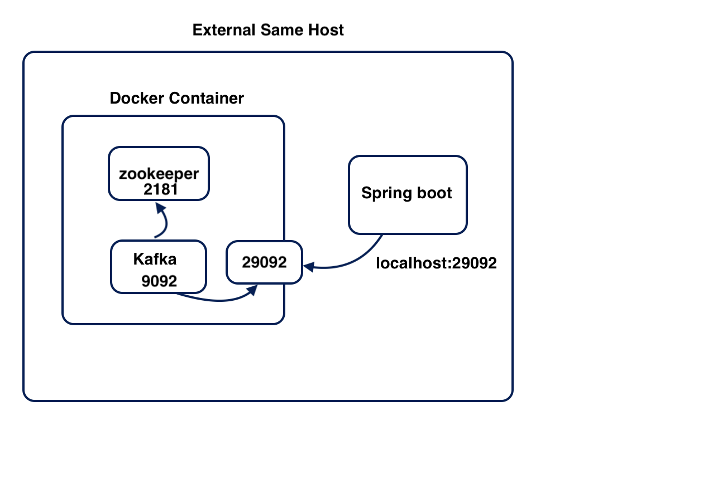
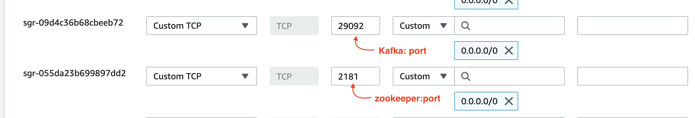
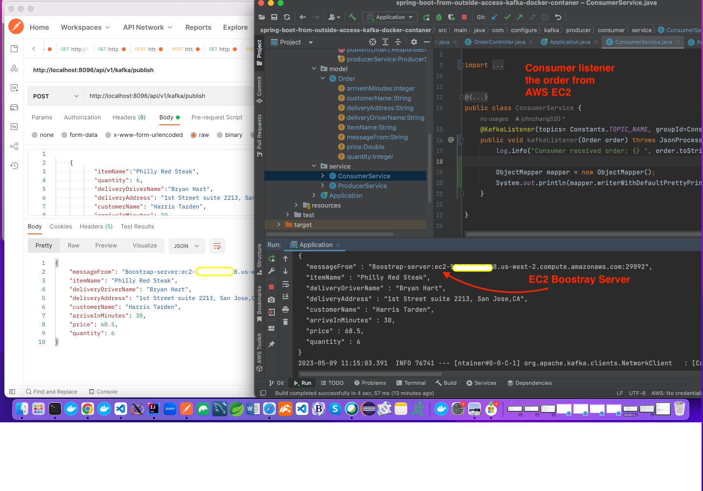

 
# Spring boot from outside access Kafka docker container

# Key Points
 1. Introduce external same host and external different host ways for spring boot application connect to kafka container
 2. External same host: in local machine, spring boot from outside of docker to connect kafka/zookeeper docker container
 3. External different host: we create AWS EC2 kafka/Zookeeper docker container, spring boot from my local machint to connect
 4. I choose bitnami kafka and zookeeper image because the sizes are small enough to run in EC2 t2.small (t2.micro is not enough)
# Work flow chart
 
 

# EC2 Docker Install and Kafka Docker Compose
 We ommitted install docker and create kafka/zookeeper container in external same host, you can use the docker-compose.yml to test
 
## Here we mainly focus on external different host scenario: AWS EC2 kakfa Docker Container
 
 Creating EC2 instance do not be described here, only talk two points here
 First, you'd better set Elastic IP which will keep your public Ip or EC2 domain stable otherwise restarting instance change IP.
 Second, to run kafka / zookeeper, you may need 1 more GB memory, t2.micro is less than 1GB, I experienced the memory lack error, 
 so choose t2.small, you get 2GB memory, here is procedure

## Associate your Elastic IP 
  EC2 dashboard --> Elastice IPs-->Allocation Elastic IP address-->Amazon's pool of IPv4 address--> Allocate button
  After allocat elastic IP
  Directly click Instance Id (e.g i-05ba8d281c51d19c6) --> click on Public IPv4 address --> click on 'Associate Elastic IP Address'
  
## Select 2GB memory
  Choose your instance-->Select 'Action' and Stop your instance-->once it is stopped, choose 'Action'-->Instance Setting-->Instance Type-->
  In type selection drop down, scroll down select 't2.samll'-->restart the instance --> click on Associate

## Install Docker 
 
 SSH Login in your EC2 instance --> run following command
 
     sudo yum install docker
     sudo systemctl enable docker.service
     sudo systemctl start docker.service

## Configure EC2 instance VPC
  
  You need to configure your network to allow external clients to be able to reach the kafka container in EC2 instance from outside
  
  select your instance --> click on 'Security' tab--> click your security group such as 03af811ab4da2764b --> Edit Inbound Rules-->
   
  open kafka port number 29092 as 0.0.0.0/0 ensure extenal clients can reach --> open zookeeper 2181 just case for multi node cluster
   
  
   
## EC2 Node Address and Setting in Spring Boot Code
  Public IPv4 A.B.C.D 
  Public Node Address A.B.C.D:29092
  Private Address: 172.31.24.237   
  
## Change Spring Boot Boostrap Server Address   
  For example suppose your IP is 53.23.54.207 then A.B.C.D = 53.23.54.207, you use the IP address replace follow code in Constants.java
  see "Spring boot Application"
    
# Configure Docker Container
 
## volume setting
  Bitnami Images run in user-mode, actually User_ID 1001, to persist Kafka and Zookeeper data to your host file system, you have to
  map two directories to docker containers, suppose you have two directories /zookeeper and /kafka , running following command
    sudo chown 1001.1001 /zookeeper/
    sudo chown 1001.1001 /kafka/

## zookeeper in docker-compose.yml 
   ZOO_SERVER_ID is assigned to every node in kafka cluster, here we only use one node, it is 1

## kafka in docker-compose.yml    
   KAFKA_BROKER_ID is the unique identifier of the Kafka instance, if you have two nodes in your cluster, first broker KAFKA_BROKER_ID=1
   second one KAFKA_BROKER_ID=2
   KAFKA_CFG_NUM_PARTITIONS is set here to 1 by default, but in real applications you should create topics with many partitions
   
## kafka listner configuration     
   Many places introduce the kafka listener , kafka advertise listener and listener protocol map, especially confluent kafka image allows to 
   costumize the listner name, such as EXTERNAL_SAME_HOST , EXTERNAL_DIFFERENT_HOST, INTERNAL so on so forth.
   But Bitnami Kafka container apply those listener name always throw following exception
   
         java.lang.IllegalArgumentException: requirement failed: inter.broker.listener.name must be a listener name defined 
         in advertised.listeners. The valid options based on currently configured listeners are INTERNAL,EXTERNAL_SAME_HOST
  
   I found Bitnami default accepts those listener names:PLAINTEXT,CONTROLLER,EXTERNAL, using those names avoided above exception
   
        - KAFKA_LISTENER_SECURITY_PROTOCOL_MAP=PLAINTEXT:PLAINTEXT,EXTERNAL:PLAINTEXT
        - KAFKA_CFG_LISTENERS=PLAINTEXT://0.0.0.0:19092,EXTERNAL://0.0.0.0:29092
        - KAFKA_CFG_ADVERTISED_LISTENERS=PLAINTEXT://kafka-services:19092,EXTERNAL://ec2-A-B-C-D.us-west-2.compute.amazonaws.com:29092
        
## Run docker-compose.yml
   Either in your EC2 SSH terminal, vi docker-dompose.yml and then copy-paste ./ec2/external-different-host-docker-compose/docker-compose.yml
   or upload by scp -i your_keypair.pem  docker-compose.yml to EC2 instance
   Change those A-B-C-D entire DNS name with your public IP address or dns name
   
        sudo /usr/local/bin/docker-compose up --remove-orphans
        

## Create Topic before runng spring boot  
  Although KAFKA_CFG_AUTO_CREATE_TOPICS_ENABLE=true and in Spring boot bean create topic as well, somehow confleunt or bitnami, they cause
  Spring boot application waiting for create topic forever
  
  in your local, ensure your install kafka and set kafka home directory in .bashrc or .bash_ptofile file

     $KAFKA_HOME/bin/kafka-topics.sh --create --bootstrap-server ec2-A-B-C-D.us-west-2.compute.amazonaws.com:29092 --replication-factor 1 —
     partitions 1 --topic OrderTopic
     
 Create this topic is also testing to reach EC2 Kafka Container
  
# Spring boot Application  

  Running in local Intellij and set Bootstrap-server in config/Constants.java
  
        public interface Constants {
            public static final String TOPIC_NAME="OrderTopic";
            public final String GROUP_ID_CONFIG="myGroup";
            // run kafka container in local remove comment
            // public final String BOOTSTRAP_NAME="localhost:29092";  
            // run kafka container in EC2 replace below DNS as your EC2 instance DNS
            public final String BOOTSTRAP_NAME="ec2-A-B-C-D.us-west-2.compute.amazonaws.com:29092";

       }
# Running Spring boot application in PostMan
 After reaching EC2 to create Topic and changing boostrap-server in Constants.java, start Application.java in Intellij
 ensure no issue, go to PostMan, set POST and copy below URL to 'address' and data to 'request body'. running kafka 
 producer and consumer event driven code
 
        POST

        http://localhost:8096/api/v1/kafka/publish

	      {
           "itemName":"Philly Red Steak",
           "quantity": 6,
           "deliveryDriverName":"Bryan Hart",
           "deliveryAddress": "1st Street suite 2213, San Jose,CA",
           "customerName": "Harris Tarden",
           "arriveInMinutes": 30,
           "price":68.5
       }
       
# Result
  
  
