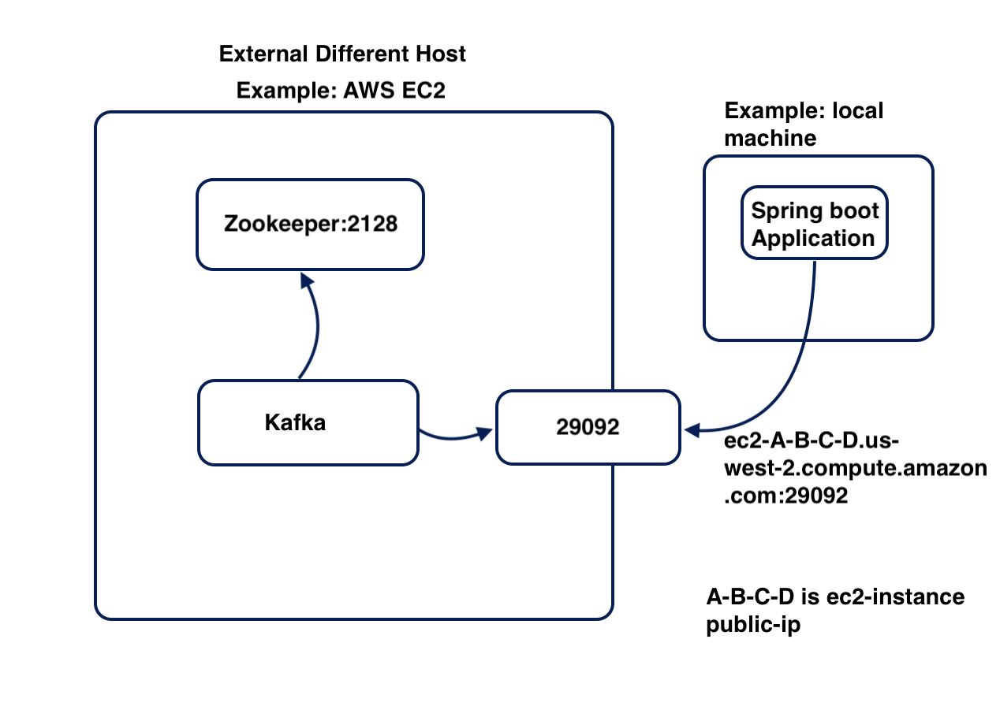

 
# Spring boot from outside access Kafka docker container

# Key Points
 1. Introduce external same host and external different host ways for spring boot application connect to kafka container
 2. External same host: in local machine, spring boot from outside of docker to connect kafka/zookeeper docker container
 3. External different host: we create AWS EC2 kafka/Zookeeper docker container, spring boot from my local machint to connect
 4. I choose bitnami kafka and zookeeper image because the sizes are small enough to run in EC2 t2.small (t2.micro is not enough)
# Work flow chart
 
 

# EC2 Docker Install and Kafka Docker Compose
 Ommit Install docker and create kafka / zookeeper , you can find the docker compose in repository
 Focus on EC2 Docker install first
 Setup EC2 instance do not be described here, only talk two points here
 First, you'd better set Elastic IP which will keep your public Ip or EC2 domain stable
 Second, to run kafka / zookeeper, you may need 1 more GB memory, t2.micro is less than 1GB, I experienced the memory lack error, 
 so choose t2.small, you get 2GB memory, here is procedure
## Select 2GB memory
 Choose your instance-->Select 'Action' and Stop your instance-->once it is stopped, choose 'Action'-->Instance Setting-->Instance Type-->
 In type selection drop down, scroll down select 't2.samll'-->restart the instance

## Install Docker 
 
 SSH Login in your EC2 instance --> run following command
 
     sudo yum install docker
     sudo systemctl enable docker.service
     sudo systemctl start docker.service
     
     

## Configure EC2 instance VPC
  
   You need to configure your network to allow external clients to be able to reach the kafka container in EC2 instance from outside
  
   select your instance --> click on 'Security' tab--> click your security group such as 03af811ab4da2764b --> Edit Inbound Rules-->
   
   open kafka port number 29092 as 0.0.0.0/0 ensure extenal clients can reach --> open zookeeper 2181 just case for multi node cluster
   

  
  
  
 
  
 
